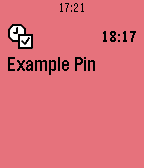

# push-pin-app

This is a Pebble SDK 3.0 example app that demonstrates how an app can use
PebbleKit JS to push a pin to itself through the 
[public timeline API](https://developer.getpebble.com/guides/timeline/timeline-public/).

It includes a segment of JS code (marked 'timeline lib') that can be re-used in
any Pebble app that needs to push pins to its user.

## Setup

In order for it to work, you must do the following:

1. Generate a new UUID for `appinfo.json` with `uuidgen` or similar method.

2. Upload the modified app to the 
  [Developer Portal](https://dev-portal.getpebble.com) (it does not need to be 
  published).

3. [Enable it for the timeline](https://developer.getpebble.com/guides/timeline/timeline-enabling/).

## Try it out!

The app will push a pin with a random `id` to a time one hour in the future.
After running the app, check the future of your timeline!

You can remove the pins by pressing the Select button on a pin in the timeline
and choosing 'Remove'.